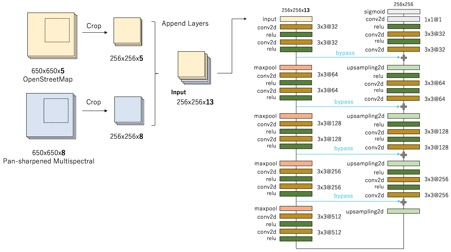
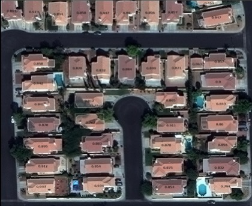
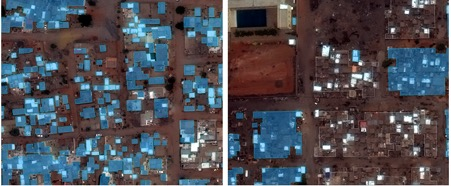
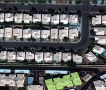
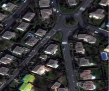
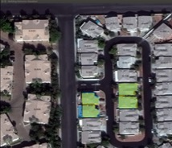

**Marathon Match - Solution Description**

**Overview**

**Figure1** : Best individual model with using OpenStreetMap and Pan-sharpened Multispectral data.

I applied a modified U-Net model, one of deep neural network model for image segmentation. My final submission is the averaging ensemble from individually trained three U-Net models. In addition, I found the use of OpenStreetMap data is effective for predicting the building footprint. My best individual model simply uses OpenStreetMap layers and multispectral layers as the input of the deep neural network simultaneously (as described in Figure1).

[Nicolas et al 2017] published on May 17, also investigates the use of OpenStreetMap for semantic labeling of satellite image. I individually investigated and evaluated the same approach on Spacenet Challenge dataset (my first submission with the approach is on May 13, a little earlier than their publication).

1. **1.**** Introduction**

- **●●**** Handle**: XD\_XD

1. **2.**** Solution Development**

How did you solve the problem? What approaches did you try and what choices did you make, and why? Also, what alternative approaches did you consider?

- **●●**** (Modeling)**. I solved the problem as a semantic segmentation task in computer vision. My model is based on a variant of fully convolutional neural network, U-Net [[Olaf et al, 2015]](https://arxiv.org/abs/1505.04597). U-Net is one of the most successful and popular convolutional neural network architecture for medical image segmentation. It can be trained end-to-end from few images and outperform the prior best method on the ISBI cell tracking challenge 2015.
Figure 2 shows an example output by my solution with U-Net models. Most building footprints are successfully detected with high intersection area over union (&gt; 0.8). Another example output of L-shaped and concave buildings in Vegas is shown in Figure 2.1. Lee Cohn, a data scientist at CosmiQ Works, [described his result of applying the Multi-task Network Cascades (MNC)](https://medium.com/the-downlinq/object-segmentation-on-spacenet-via-multi-task-network-cascades-mnc-f1c89d790b42) and MNC struggles with L-shaped and concave buildings. By contrast, my U-Net based model can detect L-shaped and concave buildings successfully.
- **●●**** (RGB or MUL)**. In early stage of the contest, I only used RGB 3 channels. Later I found that using 8-bands multispectral data improves the performance.

**Figure 2** : An example output in Vegas from validation set. Most building footprints are precisely detected. The number displayed on the building footprint represents the intersection area over union (IoU) between the prediction and the ground truth.

**Figure 2.1** : Another example output in Vegas. L-shaped and concave buildings are detected successfully.

1. **3.**** Final Approach**

Please provide a bulleted description of your final approach. What ideas/decisions/features have been found to be the most important for your solution performance:

- **●●** ( **Parameter optimization** ). To develop the individual U-net model, I split the training data into two parts: 70 percent for training and the remaining 30 percent for validation. To avoid overfitting, early stopping with Jaccard coefficient is applied for training. After training the model with 70 percent of the data, the trained model is evaluated on the remaining 30 percent and chose the best one.
- **●●** ( **Trade-off between precision and recall** ). I noticed precision on small objects is not good compared with other objects. Consequently, it is possible to improve F-score by eliminating small objects. I searched the threshold size of minimum polygon area by using validation set and eliminated small objects under the area size.
- **●●** ( **Averaging Ensemble** ). I created various U-Net models and built an averaging ensemble of three U-Net models. A diverse set of models was selected for ensemble. First model is learnt with global context by rescaling multispectral images from 650x650 pixsels into 256x256 pixsels. Second model uses the original scale multispectral data. Third model uses the original scale and the combination of OpenStreetMap and multispectral data.
- **●●** ( **OpenStreetMap** ). Joint learning from OpenStreetMap and multispectral data works. By observation, footprints of residential and industrial buildings has different shape. Obviously, there are no buildings on water area or road in general. I used the layer of residential land use, agricultural land use, industrial land use, water area, buildings and roads on OpenStreetMap. Figure 3.1 shows the example of layers on OpenStreetMap.

**Figure 3** : Performance comparison on the provisional scores. v9s uses 256/650 scale multispectral images. v13 uses the original scale multispectral images. v16 uses the original scale multispectral images and OpenStreetMap data. v17 is an ensemble model with averaging the prediction probability of v9s, v13 and v16 model.

**Figure 3.1** : Examples of layers on OpenStreetMap: From left side, ground truth, earth observation, buildings, residential land use, industrial land use and roads.

1. **4.**** Open Source Resources, Frameworks and Libraries**

Please specify the name of the open source resource along with a URL to where it&#39;s housed and it&#39;s license type:

- **●●** Docker, [https://www.docker.com](https://www.docker.com), (Apache License 2.0)
- **●●** Nvidia-docker, [https://github.com/NVIDIA/nvidia-docker](https://github.com/NVIDIA/nvidia-docker), ( [BSD 3-clause](https://github.com/NVIDIA/nvidia-docker/blob/master/LICENSE))
- **●●** OpenStreetMap, [http://www.openstreetmap.org/export](http://www.openstreetmap.org/export), ( [ODbL](http://www.openstreetmap.org/copyright))
  - **○○** Shapefiles are dumped via Metro-extracts   [https://mapzen.com/data/metro-extracts/](https://mapzen.com/data/metro-extracts/). This tool is also open-sourced:
  - **○○** Metro-extracts, [https://github.com/mapzen/metro-extracts](https://github.com/mapzen/metro-extracts), ISC
- **●●** Python 3, https://www.python.org/, ( [PSFL (Python Software Foundation License)](https://docs.python.org/3/license.html))
- **●●** Shapely, [https://github.com/Toblerity/Shapely](https://github.com/Toblerity/Shapely), ( [BSD 3-clause](https://github.com/Toblerity/Shapely/blob/master/LICENSE.txt))
- **●●** Fiona, [https://github.com/Toblerity/Fiona](https://github.com/Toblerity/Fiona), ( [BSD 3-clause](https://github.com/Toblerity/Fiona/blob/master/LICENSE.txt))
- **●●** Scikti-image, [http://scikit-image.org/](http://scikit-image.org/), ( [BSD 3-clause](https://github.com/scikit-image/scikit-image/blob/master/LICENSE.txt))
- **●●** Scikit-learn, [http://scikit-learn.org/stable/](http://scikit-learn.org/stable/), (BSD 3-clause)
- **●●** Numpy, [http://www.numpy.org/](http://www.numpy.org/), (BSD)
- **●●** Scipy, [https://www.scipy.org/](https://www.scipy.org/), (BSD)
- **●●** Tqdm, [https://github.com/noamraph/tqdm](https://github.com/noamraph/tqdm), ( [The MIT License](https://github.com/noamraph/tqdm/blob/master/LICENSE))
- **●●** Gdal, [http://www.gdal.org/](http://www.gdal.org/), (X/MIT)
- **●●** Click, [http://click.pocoo.org/5/](http://click.pocoo.org/5/), ( [BSD 3-clause](http://click.pocoo.org/5/license/))
- **●●** Pandas, [http://pandas.pydata.org/](http://pandas.pydata.org/), ( [BSD 3-clause](https://github.com/pandas-dev/pandas/blob/master/LICENSE))
- **●●** Pytables, [http://www.pytables.org/](http://www.pytables.org/), ( [BSD 3-clause](https://github.com/PyTables/PyTables/blob/develop/LICENSE.txt))
- **●●** Rasterio, https://github.com/mapbox/rasterio,( [BSD 3-clause](https://github.com/mapbox/rasterio/blob/master/LICENSE.txt))
- **●●** Keras, [https://keras.io/](https://keras.io/), ( [The MIT License](https://github.com/fchollet/keras/blob/master/LICENSE))
- **●●** Anaconda, https://www.continuum.io/Anaconda-Overview,( [New BSD License](https://docs.continuum.io/anaconda/eula))

1. **5.**** Potential Algorithm Improvements**

Please specify any potential improvements that can be made to the algorithm:

- **●●**** (More models into Ensemble)**.  Before the final submission, I verified an ensemble model with 6 models and it outperforms my final submission, scored over 700,000 on the provisional stage.
- **●●**** (More different scales)**.  Adding different scales could improve the score.
- **●●**** (More layers of OpenStreetMap)**. Developing and changing a network architecture could reduce the size of the required graphical RAM and computational time. See also: [[Dimitrios et al, 2016]](https://arxiv.org/abs/1612.01337) and [[Nicolas et al, 2017]](https://arxiv.org/abs/1705.06057)
- **●●**** (Modeling)**. Pixel Deconvolutional Networks [[Hongyang et al 2017]](https://arxiv.org/abs/1705.06820) is also interesting to try out for semantic segmentation.
- **●●**** (Signed distance transform)**. Signed distance transformation of roads on OpenStreetMap could be good as preprocessing, though I used binary representation of the OpenStreetMap data for roads. [[Nicolas et al, 2017]](https://arxiv.org/abs/1705.06057) uses &quot;Signed distance transform&quot; for roads.
- **●●**** (Batch normalization)**. Segmentation nets are numerically unstable. Due to the fact, Julian de Wit applied Batch normalization for his U-net model, described on [his blogpost](http://juliandewit.github.io/kaggle-ndsb/).

1. **6.**** Algorithm Limitations**

Please specify any potential limitations with the algorithm:

- **●●** Low precision for small object, especially in the case of Shanghai and Khartoum.
- **●●** As in the case of Khartoum, my solution does not have good results in scenes where annotation rules are not clear, see Figure 4.
- **●●** My model is unable to recognize multiple buildings that are close in distance as one building footprint. Examples of false negatives are shown in Figure 4.1.

**Figure 4** : The annotation rules in Khartoum are relatively ambiguous. As the result, the shape of predictions are unclear. On the right image, the ground truth (blue or white part) is grouped and large. On the left, the ground truth is separated and small.

**Figure 4.1** : Examples of false negatives. My model recognizes multiple buildings that are close in distance as one building footprint.

1. **7.**** Deployment Guide**

Please provide the exact steps required to build and deploy the code:

The instruction is described in a separate document:

[https://www.dropbox.com/s/dsfymmtc2at3dhb/20170527\_docs\_dockerized\_solution\_v2.html?dl=0](https://www.dropbox.com/s/dsfymmtc2at3dhb/20170527_docs_dockerized_solution_v2.html?dl=0)

1. **8.**** Final Verification**

Please provide instructions that explain how to train the algorithm and have it execute against sample data:

The instruction is described in a separate document:

[https://www.dropbox.com/s/dsfymmtc2at3dhb/20170527\_docs\_dockerized\_solution\_v2.html?dl=0](https://www.dropbox.com/s/dsfymmtc2at3dhb/20170527_docs_dockerized_solution_v2.html?dl=0)
